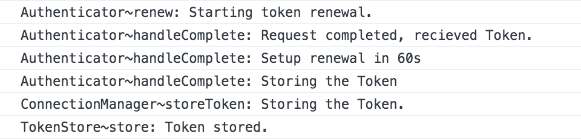

# Thesis App
Um die Funktionsweise des in dieser Thesis entwickelten Connection Managers und der zugehörigen Komponenten zu demonstrieren, wurde eine Applikation entwickelt, die als beispielhafter Rahmen die Single-Page-Webapplikation "DC/OS UI" ersetzt, in die der Connection Manager implementiert wurde. 
Zu Demonstrationszwecken ist es ausreichend den Connection Manager in einer abstrahierten und reduzierten Rahmenapplikation zu zeigen.

## Installation
Zur installation dieser Applikation wird zunächst das Repository geklont und `npm install` ausgeführt. node und npm sollten in einer aktuellen version installiert sein. 

## Starten der Applikation
Nachdem die app installiert ist kann ueber `npm run bundle` der Code compiliert werden. Danach kann der `html` Ordner über einen beliebigen Webserver ausgeliefert werden. Soweit python installiert ist, kann dies bspw. ueber den befehl `python3 -m http.server` geschehen

## Aufbau des Codes
Dieses Repository installiert die Pakete `@dcos/connection-manager` und `@dcos/connection` aus den von mir für diese Thesis erstellten Forks
- https://github.com/juliangieseke/connection-manager
- https://github.com/juliangieseke/connections

Die Forks wurden erstellt, da die beiden Originalrepositories mittlerweile bereits in DC/OS UI integriert wurden und ich für die Thesis an einigen Stellen den Code etwas anpassen musste. Auf diese Weise wurden Konflikte mit den Entwicklungen in DC/OS UI vermieden.

## Inhalt der Thesis
Diese beiden oben genannten Forks sind zusammen mit der datei `src/Authenticator/Authenticator.js` der eigentliche Inhalt meiner Thesis, die "Thesis-App" (`app.js` und `src/Util/Util.js`) dient lediglich der Demonstration der beiden Komponenten. Die Bibliothek `immutable` wurde lediglich verwendet und ist ebenfalls nicht von mir erstellt.

### Authenticator
Der Authenticator ist noch nicht in DC/OS UI implementiert.
Daher habe ich für diese Thesis eine einfache Implementierung erstellt, die über Browserausgaben (`console.log`) einige Protokolle ausgibt.

## Verwendung der App
Die Thesis-App kann verwendet werden, um mit Hilfe der Browsertools einige Szenarien nachzustellen, die für eine Verbindungsverwaltung kritisch werden können.

### Chrome Dev Tools
Am einfachsten lässt sich die App über den Webbrowser Chrome verwenden, da dieser aktuell die besten Dev Tools zur Verfügung stellt

#### Console-Tab
Der Authenticator gibt über die Konsole der DevTools einige nützliche Informationen aus. 

#### Network Tab
Über den Network Tab lassen sich die einzelnen Requests nachverfolgen und über die Einstellungen lässt sich außerdem eine schlechte Verbindung simulieren

Es ist ratsam, die Verbindung auf "Slow 3G" zu stellen, da sonst durch die schnelle Netzwerkverbindung das Nachvollziehen der Requests erschwert wird.

### (Simple) Authentication State
Über dieses Formular lässt sich ein Login simulieren. 
Die Token lifetime simuliert die Laufzeit eines Tokens.
Diese Requests haben immer die Prioritaet 4.

### Add random Requests (Noise)
Über dieses Formular lassen sich in gegebenen Abständen (`interval`) Requests mit zufälligen Prioritäten (`min prio` und `max prio`) abschicken.
- `keep queue short` verhindert ein Überfluten der Warteschlange mit Requests (Max 10)
- `increase prio` erhöht die Priorität eines requests, wenn er nach 60 Sekunden noch nicht gestartet wurde

### Manually create Request
Über dieses Formular lassen sich manuell Requests hinzufügen.
- `file` gibt an welche Datei geladen werden soll
- `prio` gibt die Priorität des requests an
- `open?` gibt an, ob der request direkt gestartet wird (nicht verwaltet!)
- `add?` gibt an, ob der request dem Connection Manager übergeben werden soll
- `cancel, if not started?` gibt an, ob der request abgebrochen werden soll, wenn er nach einer angegebenen Zeitspanne nicht gestartet wurde
- `cancel after` definiert den Zeitraum, nach der der request gestoppt wird
- `waiting/ttfb/complete: s / s / s` gibt die Zeiten an, die der request gewartet hat / auf das erste byte warten musste, bis er fertig war

### Reschedule last waiting connection
Über dieses Formular lässt sich die Priorität des angegebenen Requests ändern
- `prio` gibt die neue Priorität an

### Open Connections (Anzahl)
Gibt an, wie viele Verbindungen gerade offen sind

### Waiting Connection (Anzahl)
Gibt an, wie viele Requests gerade in der Warteschlange sind.